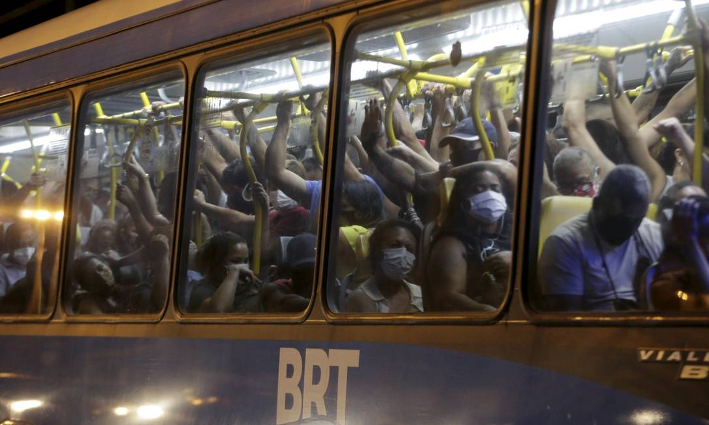

```{r xaringan-themer, include=FALSE, warning=FALSE}
# carrega o tema da apresentação
library(xaringanthemer)
style_mono_accent(
  base_color = "#1c5253",
  header_font_google = google_font("Josefin Sans"),
  text_font_google   = google_font("Montserrat", "300", "300i"),
  code_font_google   = google_font("Fira Mono")
)
```

# Tópicos da apresentação
1. Breve apresentação histórica das infraestruturas de transporte </br> público na cidade.
2. Dados socioeconômicos da cidade
3. A proposta do BRT
4. A primeira intervenção: Governo Crivella (COLOCAR ANOS)
5. A segunda intervenção e a Eduardo Paes (ANOS)
6. COVID e suas implicações
---
# Breve apresentação histórica das infraestruturas de transporte </br> público na cidade.

---
## teste

# salvar o arquivo markdown para ver as alterações em slides novos
como mudar o tamanho das imagens????

Ônibus do BRT Rio - Foto: Domingos Peixoto/Agência O Globo


---
teste

